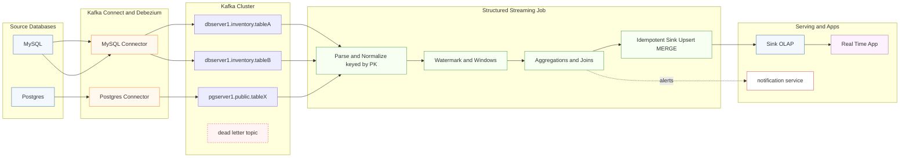
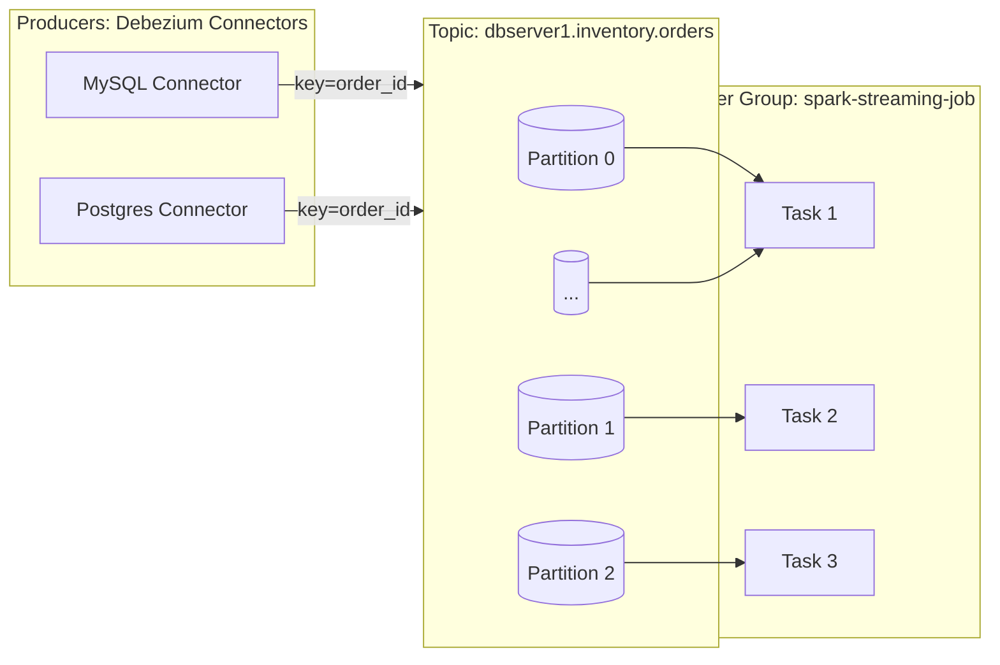

# Real-Time Streaming: Kafka + Debezium + Spark Structured Streaming

**Tagline:** *Change Data Capture → Streaming Analytics in minutes, not months.*

This is a production-style **end-to-end data pipeline**:
- **Debezium (Kafka Connect)** streams **row-level changes (CDC)** from OLTP databases (MySQL/Postgres)
- Events land in **Apache Kafka** topics (durable, replayable)
- **Spark Structured Streaming** performs **real-time ETL, enrichment, windowed aggregations** with **watermarking** + **exactly-once sinks**
- Results feed a **notification service** + **Real-Time-App** UI for live insights

> Designed to demonstrate **distributed systems + big-data engineering**: CDC semantics, event design, stateful streaming, recovery, backpressure, and horizontal scaling.

---

## 2) Architecture (High-Level)




### Why This Design

- **Debezium** → provides **low-latency Change Data Capture (CDC)** without hammering OLTP; supports initial snapshots + continuous change streams.  
- **Kafka** → ensures **durable, ordered partitions**; keys guarantee **per-entity ordering**.  
- **Spark Structured Streaming** → enables **stateful streaming** (windows, joins, deduplication) with **watermarking + checkpointing** → supports **exactly-once writes** into sinks.  
- **Idempotent sinks** → prevent duplicate records.  
- **Dead Letter Queue (DLQ)** → optional quarantine for malformed or bad events.


## 3) Debezium CDC — Deep Dive (MySQL & Postgres)

**Goal:** turn every OLTP row change into an **ordered, durable event** with enough metadata for correct downstream processing.

### 3.1 Connector Behavior & Semantics
- **Snapshots:** initial snapshot (full table read) → then **streaming** from binlog (MySQL) or WAL (Postgres).
- **Event envelope:** Debezium emits `before`, `after`, `op` (`c`=create, `u`=update, `d`=delete, `r`=snapshot), `ts_ms`, and `source` metadata.
- **Keys:** **use primary key as Kafka message key** to preserve per-entity ordering and enable idempotent upserts downstream.
- **Deletes:** represented as `op:"d"` (value with `before`) and optional **tombstone** (null value) for compaction-aware topics.
- **Offsets:** Kafka Connect stores source offsets (binlog filename/pos or LSN) → **exactly-once at source** (no missed rows after restarts).

### 3.2 Minimal Connector Configs (examples)
**MySQL**
```json
{
  "name": "mysql-inventory",
  "config": {
    "connector.class": "io.debezium.connector.mysql.MySqlConnector",
    "database.hostname": "mysql",
    "database.port": "3306",
    "database.user": "debezium",
    "database.password": "dbz",
    "database.server.id": "5401",
    "database.server.name": "dbserver1",
    "database.include.list": "inventory",
    "table.include.list": "inventory.orders,inventory.customers",
    "snapshot.mode": "initial",
    "include.schema.changes": "false",
    "topic.creation.default.partitions": "3",
    "topic.creation.default.replication.factor": "1",
    "decimal.handling.mode": "string",
    "time.precision.mode": "connect",
    "tombstones.on.delete": "true"
  }
}
```

**Postgres**
```json
{
  "name": "pg-inventory",
  "config": {
    "connector.class": "io.debezium.connector.postgresql.PostgresConnector",
    "plugin.name": "pgoutput",
    "database.hostname": "postgres",
    "database.port": "5432",
    "database.user": "debezium",
    "database.password": "dbz",
    "database.dbname": "inventory",
    "database.server.name": "pgserver1",
    "schema.include.list": "public",
    "table.include.list": "public.orders,public.customers",
    "slot.name": "debezium_slot",
    "publication.autocreate.mode": "filtered",
    "snapshot.mode": "initial",
    "tombstones.on.delete": "true",
    "topic.creation.default.partitions": "3"
  }
}
```

### Operational Flow

```bash
# Start Kafka, Connect, and Databases
docker compose up -d

# Register Debezium connectors
bash debezium-config.sh

# Verify connector status
GET /connectors/<name>/status
```

### 3.3 Data Contracts (Debezium → Kafka)

- **Topic naming:** `<server>.<schema>.<table>`  
  - Example: `dbserver1.inventory.orders`  
- **Key schema:** primary key fields only (stable across versions)  
- **Value schema:** Debezium envelope; downstream normalizes to:  
  - `after.*` fields  
  - `op` (operation type)  
  - `eventTime`  

### 3.4 Schema Evolution (Interview Points)

- Prefer **additive changes** (nullable columns)  
- **JSON without Schema Registry:** Spark must tolerate extra fields → use **permissive parsing**  
- **With Schema Registry (optional):** Avro/JSON Schema provides:  
  - Safer evolution  
  - Static typing for consumers  

---

## 4) Kafka Topic Design & Guarantees — Deep Dive

This section explains **how topics are named, partitioned, compacted/retained, keyed, and secured**, and how those choices impact **ordering, throughput, latency, and recovery** in a CDC + streaming system.

---

### 4.1 Topic Naming & Multi-Tenancy

**Pattern:** `<server>.<schema>.<table>` (Debezium default), e.g.  
- `dbserver1.inventory.orders`  
- `dbserver1.inventory.customers`  
- `pgserver1.public.payments`

**Why:**  
- Mirrors source lineage for auditability.  
- Enables **prefix ACLs** & per-schema governance (e.g., allow only Spark consumer to read `dbserver1.inventory.*`).

> **Tip:** avoid uppercase; dots are fine. Add a `*.DLQ` namespace for dead letters.

---

### 4.2 Partitioning Strategy (Throughput vs Ordering)

**Rule:** **Key by the table’s primary key (PK)** → guarantees **per-entity ordering** and avoids cross-partition reordering.

**How many partitions?**  
Let: target consumer concurrency = `C` (e.g., Spark tasks reading the topic).  
Start with **`partitions = 2–3 × C`** to allow headroom & rebalance flexibility.

**Sizing example:**  
- Target sustained ingest: **30 MB/s** topic throughput.  
- Safe per-partition rate: **2–3 MB/s** (practical for many deployments).  
- → **10–15 partitions** (round up to 16).  
- If you run **8 Spark tasks**, 16 partitions provides ≥2 partitions per task → good balance.

> **Skew watch:** If a PK is hot (few keys dominate), consider **composite keys** or **salting** (rare for CDC; usually OK).

---

### 4.3 Retention vs Compaction (History vs Latest-Value)

| Use Case                         | Policy                   | Pros | Cons |
|----------------------------------|--------------------------|------|------|
| **Full history replay**          | `retention.ms` (e.g., 7–30d) | Rebuild any downstream state | Storage grows with traffic |
| **Latest value materialization** | `cleanup.policy=compact` | Small, fast catch-up | Loses historical changes |
| **Hybrid**                       | `compact,delete` + ms    | Latest + limited history | More tuning/complexity |

**CDC guidance:**  
- **Raw Debezium topics:** typically **time-retained** (history).  
- **Downstream materialized views:** can be **compacted** (latest value per PK).

---

### 4.4 Delivery, Ordering & Durability

- **Producer acks**: Debezium (Kafka Connect) uses `acks=all` → write when ISR quorum persists.  
- **Ordering**: Kafka guarantees **per-partition ordering**; our **PK keying** ensures a single entity’s events are ordered.  
- **Consumer groups**: Spark uses one **consumer group** per job; partitions are distributed across tasks; rebalances on scale/failure.

**Min-insync-replicas (production)**  
- With replication factor **3**: set `min.insync.replicas=2`.  
- Guarantees that at least two replicas acknowledged the write.

---

### 4.5 Operational Diagram (Producers → Partitions → Consumer Group)



### 4.6 Topic Creation 
```bash
#History topic (Debezium raw)
kafka-topics --bootstrap-server kafka:9092 \
  --create --topic dbserver1.inventory.orders \
  --partitions 12 --replication-factor 1 \
  --config retention.ms=604800000 \   # 7 days
  --config segment.ms=86400000 \
  --config min.cleanable.dirty.ratio=0.5 \
  --config cleanup.policy=delete

#Materialized/latest view
kafka-configs --bootstrap-server kafka:9092 --alter \
  --entity-type topics --entity-name materialized.orders \
  --add-config cleanup.policy=compact,segment.ms=3600000

#DLQ topic
kafka-topics --bootstrap-server kafka:9092 \
  --create --topic dbserver1.inventory.orders.DLQ \
  --partitions 3 --replication-factor 1 \
  --config retention.ms=2592000000   # 30 days
```

### 4.7 Headers, Schema & Payloads

- **Headers:**  
  - Debezium adds metadata headers.  
  - You can attach **trace IDs** upstream to propagate through Spark → sinks (for observability).  

- **Schema Strategy:**  
  - **JSON (no registry):** flexible, but Spark must parse **permissively**.  
  - **Avro/JSON Schema + Schema Registry (future):** enables **compatibility rules** and **strong typing** for consumers.  

- **Deletion Semantics:**  
  - Debezium emits `op='d'` events for deletes.  
  - Optionally emits **tombstones** (null values) to allow **log compaction cleanup**.  

### 4.8 Quick Decision Matrix

| **Decision**   | **Pick**                     | **When**                                      |
|----------------|------------------------------|-----------------------------------------------|
| **Key**        | Primary key                  | Always — ensures CDC correctness & ordering   |
| **Partitions** | 2–3× consumer tasks          | When you need parallelism & headroom          |
| **Cleanup**    | `delete` retention           | Keep full history for replay                  |
|                | `compact`                    | Need a latest-value view                      |
| **Replication**| 3 + `min.insync.replicas=2`  | For production durability                     |
| **Schema**     | JSON (permissive)            | Simplicity; dev/test environments             |
|                | Avro + Registry              | Strong typing & governed schema evolution     |
| **DLQ**        | yes                          | Tolerate bad records without halting pipeline |

---

## 5) Spark Structured Streaming — Design & Internals

### 5.1 Ingest & Normalization

- **Source:** `format("kafka")`, subscribe to Debezium topics  
- **Parse:**  
  - Cast key/value to strings  
  - `from_json` with permissive schema  
  - Extract `payload.after` as the current row  
  - Keep `op` (operation)  
  - Derive `eventTime` from CDC metadata (`ts_ms`) or a row timestamp column  
- **Normalize deletes:**  
  - (a) Emit tombstones to sink, or  
  - (b) Handle hard deletes in sink by key  

---

### PySpark Skeleton

```python
df = (spark.readStream.format("kafka")
      .option("kafka.bootstrap.servers", "kafka:9092")
      .option("subscribe", "dbserver1.inventory.orders")
      .option("startingOffsets", "latest")
      .load())

parsed = (df.selectExpr("CAST(key AS STRING)", "CAST(value AS STRING)")
            .withColumn("value_json", from_json(col("value"), debezium_schema))
            .select(col("key").alias("pk"),
                    col("value_json.payload.op").alias("op"),
                    col("value_json.payload.after").alias("after"),
                    (col("value_json.payload.source.ts_ms")/1000)
                        .cast("timestamp")
                        .alias("eventTime")))
```
### 5.2 Event Time, Watermarking, Windows

- Event-time makes results robust to network jitter/out-of-order data.

- Watermark bounds state: e.g., withWatermark("eventTime", "10 minutes").

- Windows: tumbling (5m), sliding (5m slide 1m), session (inactivity gap).


```python
#Windowed aggregation
agg = (parsed
       .withWatermark("eventTime", "10 minutes")
       .selectExpr("after.*", "eventTime")
       .groupBy(window(col("eventTime"), "5 minutes"), col("customer_id"))
       .agg(count(lit(1)).alias("events"), sum("amount").alias("amount")))
```

## 5.3 Joins

- **Stream–Stream Join**  
  - Join two CDC streams keyed by the same id  
  - Apply **watermark** on both sides to bound state  

- **Stream–Static Join**  
  - Enrich streaming facts with a small static dimension table  
  - Use **broadcast join** for efficiency  

---

### 5.4 Deduplication

- If source can **resend events**, deduplicate using:  
  - **(key, eventTime)** combination, or  
  - A **monotonically increasing version/LSN** when available  

```python
# Example: drop duplicates within 10 minutes per primary key
dedup = (parsed
         .withWatermark("eventTime", "10 minutes")
         .dropDuplicates(["pk", "eventTime"]))
```

### 5.5 Exactly-Once at the Sink

- **Checkpointing**  
  - Spark stores offsets & state under `checkpoint_spark/<job>`  
  - On restart → resumes from the last committed batch  

- **Idempotent Upsert**  
  - Use **JDBC MERGE** inside `foreachBatch`, e.g.:  
    - MySQL → `INSERT ... ON DUPLICATE KEY UPDATE`  
    - Postgres → `INSERT ... ON CONFLICT DO UPDATE`  

- **No Double-Apply**  
  - Each batch is committed **once**  
  - Each row is **upserted by PK**, preventing duplicates  

**foreachBatch upsert (MySQL example)**
```python
def upsert_to_mysql(batch_df, batch_id):
    rows = batch_df.selectExpr("after.order_id as order_id",
                               "after.customer_id as customer_id",
                               "after.amount as amount",
                               "eventTime as event_time").collect()
    import mysql.connector
    conn = mysql.connector.connect(host="mysql", user="app", password="app", database="serving")
    cur = conn.cursor()
    sql = """
      INSERT INTO orders (order_id, customer_id, amount, event_time)
      VALUES (%s,%s,%s,%s)
      ON DUPLICATE KEY UPDATE amount=VALUES(amount), event_time=VALUES(event_time)
    """
    cur.executemany(sql, [(r["order_id"], r["customer_id"], r["amount"], r["event_time"]) for r in rows])
    conn.commit(); cur.close(); conn.close()

(agg.writeStream
   .outputMode("update")
   .foreachBatch(upsert_to_mysql)
   .option("checkpointLocation", "checkpoint_spark/orders_agg")
   .start())
```

### 5.6 Throughput & Backpressure

- **maxOffsetsPerTrigger:** cap intake per micro-batch to protect sinks  
- **Trigger:**  
  - `Trigger.ProcessingTime("5 seconds")` → predictable cadence  
  - Continuous processing (advanced mode)  
- **Parallelism:**  
  - Align Kafka partitions ≈ Spark tasks  
  - Tune `spark.sql.shuffle.partitions` for load  

---

### 5.7 Failure & Recovery

- **Source outage:** Spark waits; on recovery resumes from last committed offsets  
- **Job crash:** restart → Spark replays uncommitted micro-batch; idempotent sink prevents duplicates  
- **Poison message:** route to **DLQ** in Kafka Connect, or filter in Spark with audit logging  

---

## 6) Serving Layer (Sinks) — Schemas, Indexes, Idempotency

### 6.1 OLAP/Serving Tables (examples)
**MYSQL**
```sql
CREATE TABLE orders (
  order_id      BIGINT PRIMARY KEY,
  customer_id   BIGINT NOT NULL,
  amount        DECIMAL(12,2) NOT NULL,
  event_time    TIMESTAMP NOT NULL,
  updated_at    TIMESTAMP NOT NULL DEFAULT CURRENT_TIMESTAMP ON UPDATE CURRENT_TIMESTAMP
);
CREATE INDEX idx_orders_customer_time ON orders (customer_id, event_time);
```

**Postgres**
```sql
CREATE TABLE orders (
  order_id    BIGINT PRIMARY KEY,
  customer_id BIGINT NOT NULL,
  amount      NUMERIC(12,2) NOT NULL,
  event_time  TIMESTAMP NOT NULL
);
CREATE INDEX idx_orders_customer_time ON orders (customer_id, event_time);
```

### 6.2 Deletes

- If `op='d'`, handle deletes in one of two ways:  
  - Hard delete in sink: DELETE FROM orders WHERE order_id=?, or
  - Soft delete: add is_deleted boolean + filter in queries.

---

### 6.3 Query Patterns

- Recent orders for customer: WHERE customer_id=? AND event_time > NOW()-interval '7 day'
- Windows: aggregate table produced by Spark; BI reads without hitting raw topics.
