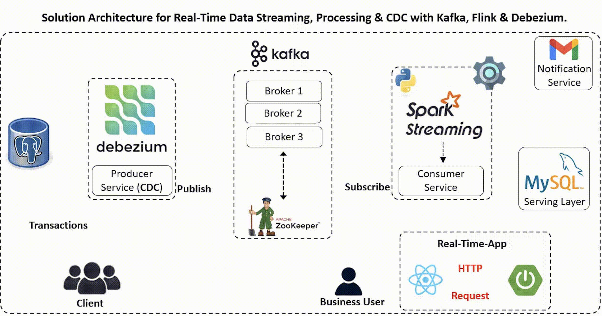
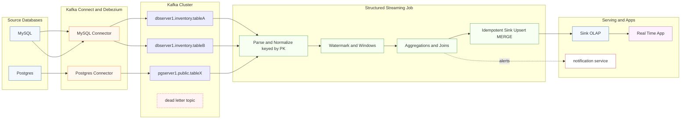

# Real-Time Streaming: Kafka + Debezium + Spark Structured Streaming

**Tagline:** *Change Data Capture → Streaming Analytics in minutes, not months.*

This is a production-style **end-to-end data pipeline**:
- **Debezium (Kafka Connect)** streams **row-level changes (CDC)** from OLTP databases (MySQL/Postgres)
- Events land in **Apache Kafka** topics (durable, replayable)
- **Spark Structured Streaming** performs **real-time ETL, enrichment, windowed aggregations** with **watermarking** + **exactly-once sinks**
- Results feed a **notification service** + **Real-Time-App** UI for live insights

> Designed to demonstrate **distributed systems + big-data engineering**: CDC semantics, event design, stateful streaming, recovery, backpressure, and horizontal scaling.

---

## 📌 Architecture (High-Level)

