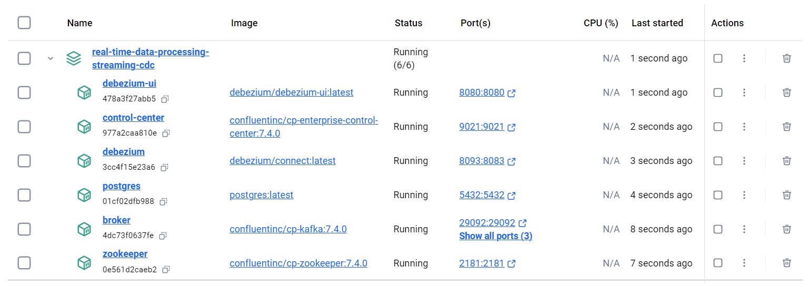
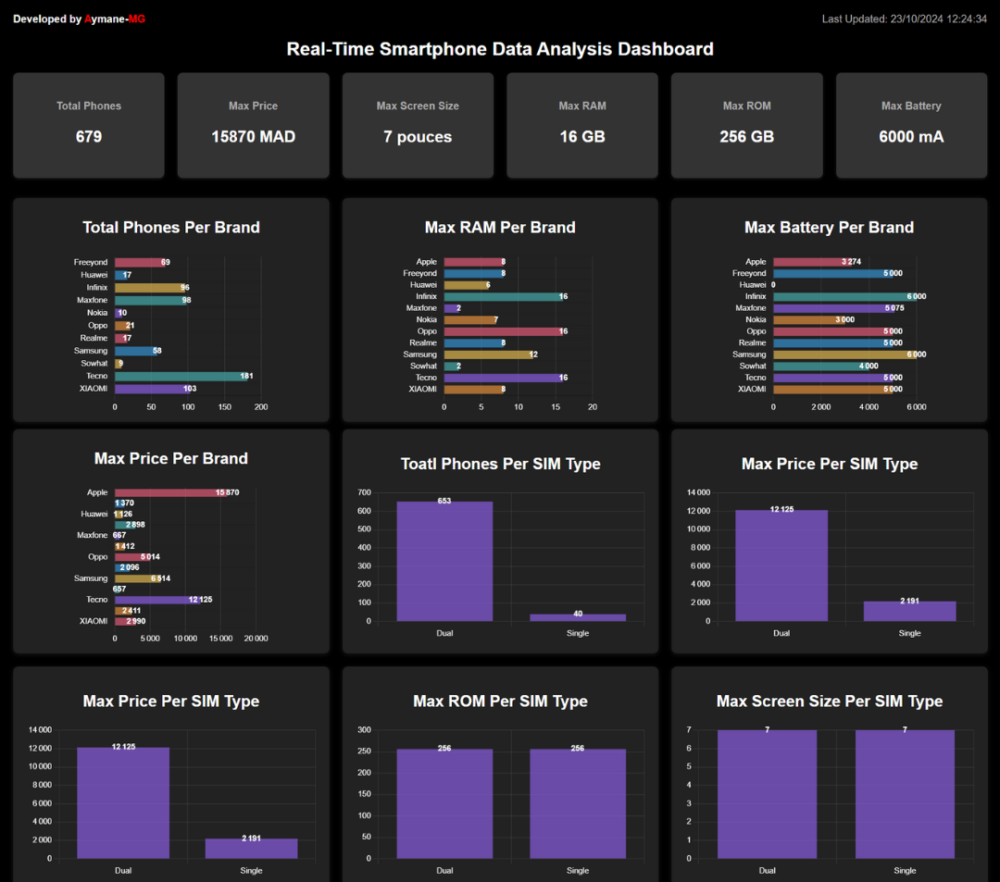

# Real-Time Data Streaming & Processing with Kafka, Spark Streaming & Debezium

## Table of Contents
1. [Project Overview](#project-overview)
2. [Technologies Used](#technologies-used)
3. [Architecture](#architecture)
4. [Software Requirements for Running the Project](#software-requirements-for-running-the-project)
5. [How to Run](#how-to-run)
6. [Dashboards](#dashboards)
7. [Acknowledgments](#acknowledgments)
8. [Conclusion](#conclusion)
9. [Contacts](#contacts)

## Project Overview
This project demonstrates real-time data streaming and processing architecture using Kafka, Spark Streaming, and Debezium for capturing CDC (Change Data Capture) events. The pipeline collects transaction data, processes it in real time, and updates a dashboard to display real-time analytics for smartphone data.

## Technologies Used
- **Kafka**: Data streaming platform.
- **Debezium**: Change Data Capture tool to stream changes from PostgreSQL to Kafka.
- **Spark Streaming**: Real-time data processing engine.
- **Spring Boot**: Backend API service.
- **React.js**: Frontend for real-time dashboard.
- **MySQL**: Database for storing aggregated analytics.
- **PostgreSQL**: Source database for transactional data.
- **Docker**: Containerization for running the services.

## Architecture


### Key Components:
- **PostgreSQL**: Source database for transactional data.
- **Debezium**: Captures changes (inserts/updates) from the PostgreSQL database and streams them into Kafka.
- **Kafka**: Message broker to publish/subscribe to topics.
- **Spark Streaming**: Consumes data from Kafka, processes it, and writes aggregated results to MySQL.
- **MySQL**: Stores the processed data for analytics.
- **Spring Boot**: Provides backend APIs for serving data to the frontend.
- **React.js**: Frontend that visualizes the processed data in real-time dashboards.
- **Notification Service**: Sends email notifications to the user when a threshold is reached.

## Software Requirements for Running the Project
To run the project, ensure you have the following:
- **Python**
- **Java**
- **Docker** (for setting up Postgres, Debezium, and Kafka)
- **Apache Spark**
- **MySQL**
- **React JS**

In this project, I used the following tools:
- **IntelliJ IDEA** for the Spring Boot backend.
- **Visual Studio Code** for the React.js frontend.
- **PyCharm** for Python scripts and services.

## How to Run
1. **Clone the Project**:
    ```bash
    git clone git@github.com:aymane-maghouti/Real-Time-Streaming-Kafka-Debezium-Spark-Streaming.git
    cd Real-Time-Streaming-Kafka-Debezium-Spark-Streaming
    ```

2. **Run Docker Compose**:
    ```bash
    docker-compose up
    ```

   This command will pull the necessary images and start the containers for Kafka, Zookeeper, PostgreSQL, Debezium.

   

3. **Create the `smartphones` Table**:
   After starting the Postgres container, navigate into it and create the `smartphones` table:
   ```sql
   CREATE TABLE smartphones (
       id INT PRIMARY KEY,
       brand VARCHAR(50),
       screen_size DECIMAL(3,2),
       ram DECIMAL(3,1),
       rom DECIMAL(4,1),
       sim_type VARCHAR(10),
       battery DECIMAL(5,1),
       price DECIMAL(6,1)
   );
   ```

   Then, insert some initial data:
   ```sql
   INSERT INTO smartphones (id, brand, screen_size, ram, rom, sim_type, battery, price) VALUES
   (9, 'Tecno', 6.8, 8.0, 128.0, 'Dual', 5000.0, 2125.0), ...
   ```

4. **Create Debezium Connector**:
   You can create a Debezium connector using the UI at `localhost:8080` or by running the following `curl` command inside the Debezium container:
   ```bash
   curl -H 'content-type: application/json' localhost:8083/connectors --data '{
     "name" : "smartphones-conn",
     "config": {
       "connector.class": "io.debezium.connector.postgresql.PostgresConnector",
       "topic.prefix": "cdc",
       "database.user": "postgres",
       "database.dbname": "smartphone_db",
       "database.hostname": "postgres",
       "database.password": "postgres",
       "database.server.name":"postgres",
       "database.port": "5432",
       "plugin.name": "pgoutput",
       "table.include.list":"public.smartphones",
       "decimal.handling.mode":"string"
     }
   }'
   ```

5. **Set up MySQL Database**:
   Create a database in MySQL to store the processed data:
```sql
-- Create the smartphones database 
create database smartphones;

use smartphones;

--  Create the tables where we will store the data coming from spark streaming job

-- 0. Table for statistics_summary
CREATE TABLE statistics_summary (
    total_phones INT,
    max_price DOUBLE,
    max_screen_size DOUBLE,
    max_ram DOUBLE,
    max_rom DOUBLE,
    max_battery DOUBLE,
    updated_at TIMESTAMP DEFAULT CURRENT_TIMESTAMP ON UPDATE CURRENT_TIMESTAMP
);

-- 1. Table for number of phones per brand
CREATE TABLE phones_per_brand (
    brand VARCHAR(100),
    total_phones INT,
    updated_at TIMESTAMP DEFAULT CURRENT_TIMESTAMP ON UPDATE CURRENT_TIMESTAMP,
    PRIMARY KEY (brand)
);

-- 2. Table for number of phones per sim type
CREATE TABLE phones_per_sim_type (
    sim_type VARCHAR(50),
    total_phones INT,
    updated_at TIMESTAMP DEFAULT CURRENT_TIMESTAMP ON UPDATE CURRENT_TIMESTAMP,
    PRIMARY KEY (sim_type)
);

-- 3. Table for max price per brand
CREATE TABLE max_price_per_brand (
    brand VARCHAR(100),
    max_price DOUBLE,
    updated_at TIMESTAMP DEFAULT CURRENT_TIMESTAMP ON UPDATE CURRENT_TIMESTAMP,
    PRIMARY KEY (brand)
);

-- 4. Table for max price per sim type
CREATE TABLE max_price_per_sim_type (
    sim_type VARCHAR(50),
    max_price DOUBLE,
    updated_at TIMESTAMP DEFAULT CURRENT_TIMESTAMP ON UPDATE CURRENT_TIMESTAMP,
    PRIMARY KEY (sim_type)
);

-- 5. Table for max RAM per brand
CREATE TABLE max_ram_per_brand (
    brand VARCHAR(100),
    max_ram DOUBLE,
    updated_at TIMESTAMP DEFAULT CURRENT_TIMESTAMP ON UPDATE CURRENT_TIMESTAMP,
    PRIMARY KEY (brand)
);

-- 6. Table for max ROM per sim type
CREATE TABLE max_rom_per_sim_type (
    sim_type VARCHAR(50),
    max_rom DOUBLE,
    updated_at TIMESTAMP DEFAULT CURRENT_TIMESTAMP ON UPDATE CURRENT_TIMESTAMP,
    PRIMARY KEY (sim_type)
);

-- 7. Table for max battery capacity per brand
CREATE TABLE max_battery_per_brand (
    brand VARCHAR(100),
    max_battery DOUBLE,
    updated_at TIMESTAMP DEFAULT CURRENT_TIMESTAMP ON UPDATE CURRENT_TIMESTAMP,
    PRIMARY KEY (brand)
);

-- 8. Table for max screen size per sim type
CREATE TABLE max_screen_size_per_sim_type (
    sim_type VARCHAR(50),
    max_screen_size DOUBLE,
    updated_at TIMESTAMP DEFAULT CURRENT_TIMESTAMP ON UPDATE CURRENT_TIMESTAMP,
    PRIMARY KEY (sim_type)
);

```

6. **Configure and Run Spark Streaming**:
   Update the database credentials in the script `insert_data.py` located in the `mysql_storage` folder and update your `.env` file with the following:
   ```
   EMAIL_SENDER=your-email
   EMAIL_RECEIVER=user-email
   EMAIL_PASSWORD=your-password
   ```

   Then, run the scripts in order:
   ```bash
   python insert-data-postgresDb.py
   python spark-streaming-consumer.py
   ```

   The first script will insert data into PostgreSQL every 30 seconds, and the second script will process the data in real time using Spark Streaming.

7. **Run the Real-Time App**:
   - **Backend (Spring Boot)**: Open the Spring Boot app in IntelliJ and run it.
   - **Frontend (React.js)**: Inside the `real-time-app` folder, run:
     ```bash
     npm install
     npm start
     ```

   Access the dashboard at `http://localhost:3000`.

## Dashboards
Here's a preview of the real-time dashboard:



you can watch the demo video <a href="https://www.youtube.com/watch?v=OeddlyLVAuQ" target="_blank">here</a> 

## Acknowledgments
Special thanks to the teams and open-source communities behind Kafka, Spark Streaming, Debezium, and Docker for making this project possible.

## Conclusion
This project showcases how CDC and real-time data processing can be implemented using Kafka, Debezium, and Spark Streaming. It demonstrates a complete flow from data ingestion to processing and visualization in a dashboard.

## Contacts
- **Developer**: Aymane-MG [Data & Software Engineer]
- **Email**: aymanemaghouti16@gmail.com
- **LinkedIn:** <a href="https://www.linkedin.com/in/aymane-maghouti/" target="_blank">Aymane Maghouti</a><br>
